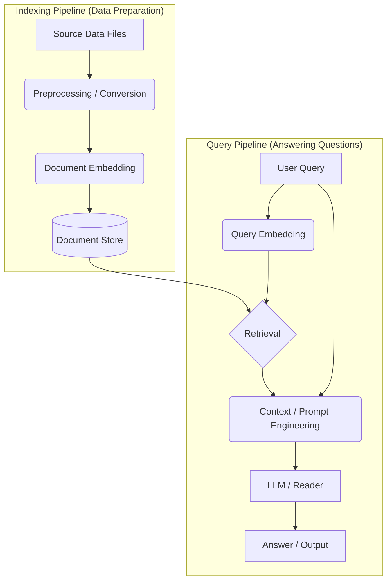

# GenAI Haystack Pipelines

## Table of Contents

1.  [Repository Overview](#1-repository-overview)
    *   [Purpose & Use Cases](#purpose--use-cases)
    *   [High-Level Architecture](#high-level-architecture)
2.  [Directory Structure Analysis](#2-directory-structure-analysis)
    *   [`1-First-RAG-Pipeline/`](#1-first-rag-pipeline)
    *   [`2-Filtering-Doc-With-Metadata/`](#2-filtering-doc-with-metadata)
    *   [`3-Serializing_Pipelines/`](#3-serializing_pipelines)
    *   [`4-Preprocessing-Different-File-Types/`](#4-preprocessing-different-file-types)
    *   [`5-Embedding-Metadata-Improved-Retrieval/`](#5-embedding-metadata-improved-retrieval)
    *   [`6-Extractive-QA-Pipeline/`](#6-extractive-qa-pipeline)
3.  [Installation & Setup](#3-installation--setup)
    *   [Prerequisites](#prerequisites)
    *   [Environment Setup](#environment-setup)
    *   [Installation](#installation)
    *   [Environment Variables & Configurations](#environment-variables--configurations)
4.  [Usage Examples](#4-usage-examples)
    *   [Running the Examples](#running-the-examples)
    *   [Sample Inputs and Outputs](#sample-inputs-and-outputs)
5.  [References](#5-references)

---

## 1. Repository Overview

Welcome to the `genai-haystack` repository! This collection showcases various example pipelines built using [Haystack 2.0](https://docs.haystack.deepset.ai/docs/intro) by deepset AI. It serves as a practical guide and starting point for developers looking to implement different Generative AI (GenAI) patterns, particularly focusing on Retrieval-Augmented Generation (RAG) and related techniques.

### Purpose & Use Cases

*   Demonstrate fundamental and advanced Haystack 2.0 pipeline construction.
*   Provide concrete examples for common GenAI tasks like Question Answering (Generative & Extractive), document preprocessing, metadata handling, and pipeline serialization.
*   Offer reusable code snippets and pipeline structures for building custom applications.
*   Serve as educational material for learning Haystack 2.0 concepts.

### High-Level Architecture

Most pipelines in this repository follow variations of the RAG pattern, which typically involves two main stages: Indexing and Querying.

**General Pipeline Flow Visualization:**

This diagram shows the conceptual separation between indexing data and querying it.



1.  **Indexing Pipeline:** Preprocesses source data (text files, PDFs, Markdown, etc.), converts it into Haystack `Document` objects, generates vector embeddings (representing semantic meaning), and stores these documents and their embeddings in a `DocumentStore`.
2.  **Query Pipeline:** Takes a user query, generates an embedding for it, retrieves relevant `Document` chunks from the `DocumentStore` based on embedding similarity (and potentially keyword matching or filtering), constructs a prompt incorporating the query and retrieved context, and feeds this prompt to a Large Language Model (LLM) to generate a final answer or perform a specific task (like extraction).

Different examples explore variations like using different retrievers, embedders, generators, handling diverse file types, filtering based on metadata, or focusing solely on extracting answers from context.

---

## 2. Directory Structure Analysis

The repository is organized into distinct directories, each demonstrating a specific Haystack pipeline or feature.

### `1-First-RAG-Pipeline/`

*   **Purpose:** Introduces the basic concept of building a Retrieval-Augmented Generation (RAG) pipeline for question answering.
*   **Functionality:** Indexes Wikipedia articles about the Seven Wonders, then answers questions using the indexed content. Uses OpenAI for generation.
*   **Query Pipeline Flow:**
    ```mermaid
    graph TD
        A[/"Query Text"/] --> B(text_embedder);
        A --> D(prompt_builder);
        B -- Embedding --> C(retriever);
        C -- Documents --> D;
        D -- Prompt --> E(llm / OpenAIGenerator);
        E --> F[/"Generated Answer"/];
    ```
*   **Key Components:**
    *   `InMemoryDocumentStore`: Stores documents and embeddings in memory. (Used in Indexing, not shown in Query Flow)
    *   `SentenceTransformersDocumentEmbedder`: Creates embeddings for documents (`sentence-transformers/all-MiniLM-L6-v2`). (Used in Indexing)
    *   `SentenceTransformersTextEmbedder` (as `text_embedder`): Creates embeddings for the user query.
    *   `InMemoryEmbeddingRetriever` (as `retriever`): Retrieves documents based on embedding similarity.
    *   `PromptBuilder` (as `prompt_builder`): Constructs the prompt for the LLM.
    *   `OpenAIGenerator` (as `llm`): Interacts with the OpenAI API (GPT-4o-mini) to generate answers.
*   **Significant Snippets:**
    *   *Pipeline Definition:*
        ```python
        from haystack import Pipeline

        basic_rag_pipeline = Pipeline()
        # Add components...
        basic_rag_pipeline.add_component("text_embedder", text_embedder)
        basic_rag_pipeline.add_component("retriever", retriever)
        basic_rag_pipeline.add_component("prompt_builder", prompt_builder)
        basic_rag_pipeline.add_component("llm", generator) # Note: 'generator' is the var name for OpenAIGenerator here

        # Connect components...
        basic_rag_pipeline.connect("text_embedder.embedding", "retriever.query_embedding")
        basic_rag_pipeline.connect("retriever.documents", "prompt_builder.documents")
        basic_rag_pipeline.connect("prompt_builder.prompt", "llm.prompt")
        ```
    *   *Running the Pipeline:*
        ```python
        question = "What does Rhodes Statue look like?"
        # The 'question' variable needs to be routed to the correct inputs
        response = basic_rag_pipeline.run({
            "text_embedder": {"text": question},
            "prompt_builder": {"question": question}
        })
        print(response["llm"]["replies"][0])
        ```
*   **Dependencies:** `haystack-ai`, `datasets`, `sentence-transformers`, `python-dotenv`, `openai` (implicitly via `OpenAIGenerator`).
*   **Requirements:** OpenAI API Key.

---

### `2-Filtering-Doc-With-Metadata/`

*   **Purpose:** Demonstrates how to filter documents based on their metadata during retrieval.
*   **Functionality:** Creates sample documents with `version` and `date` metadata. Uses a BM25 retriever (keyword-based) to search documents, applying filters on the metadata fields.
*   **Retriever Focus Flow:** (Shows only the core filtering component)
    ```mermaid
    graph TD
        A[/"Query Text + Filters Dict"/] --> B(retriever / InMemoryBM25Retriever);
        B --> C[/"Filtered Documents"/];
    ```
*   **Key Components:**
    *   `InMemoryDocumentStore`: Stores documents with metadata. Configured for BM25 (`bm25_algorithm="BM25Plus"`).
    *   `InMemoryBM25Retriever` (as `retriever`): Retrieves documents based on BM25 keyword matching, supporting metadata filters.
*   **Significant Snippets:**
    *   *Document Creation with Metadata:*
        ```python
        from haystack import Document
        from datetime import datetime

        documents = [
            Document(
                content="...",
                meta={"version": 1.15, "date": datetime(2023, 3, 30)},
            ),
            # ... other documents
        ]
        ```
    *   *Running Retrieval with Simple Filter:*
        ```python
        query = "Haystack installation"
        # Pipeline assumes a single component named 'retriever'
        pipeline.run(data={
            "retriever": {
                "query": query,
                "filters": {"field": "meta.version", "operator": ">", "value": 1.21}
            }
        })
        ```
    *   *Running Retrieval with Compound (AND) Filter:*
        ```python
        pipeline.run(data={
            "retriever": {
                "query": query,
                "filters": {
                    "operator": "AND",
                    "conditions": [
                        {"field": "meta.version", "operator": ">", "value": 1.21},
                        {"field": "meta.date", "operator": ">", "value": datetime(2023, 11, 7)},
                    ],
                },
            }
        })
        ```
*   **Dependencies:** `haystack-ai`.
*   **Requirements:** None beyond standard Haystack.

---

### `3-Serializing_Pipelines/`

*   **Purpose:** Shows how to serialize a Haystack pipeline to YAML format and deserialize it back into a Python object.
*   **Functionality:** Creates a simple pipeline using `PromptBuilder` and `HuggingFaceLocalGenerator`, serializes it to YAML, modifies the YAML string (changing the prompt template), and deserializes the modified YAML back into a runnable pipeline.
*   **Simple Generator Pipeline Flow:**
     ```mermaid
    graph TD
        A[/"Input Topic/Sentence"/] --> B(builder / PromptBuilder);
        B -- Prompt --> C(llm / HuggingFaceLocalGenerator);
        C --> D[/"Generated Text"/];
    ```
*   **Key Components:**
    *   `PromptBuilder` (as `builder`): Builds a prompt based on a template.
    *   `HuggingFaceLocalGenerator` (as `llm`): Runs a local Hugging Face model (`google/flan-t5-large`) for text generation.
    *   `Pipeline.dumps()`: Serializes the pipeline object to a YAML string.
    *   `Pipeline.loads()`: Deserializes a YAML string back into a pipeline object.
*   **Significant Snippets:**
    *   *Serialization:*
        ```python
        yaml_pipeline = pipeline.dumps()
        print(yaml_pipeline)
        ```
    *   *Deserialization:*
        ```python
        yaml_pipeline_modified = """
        components:
          builder: # Matches the component name in the pipeline object
            init_parameters:
              template: "\\nPlease translate the following to French: \\n{{ sentence }}\\n" # Modified template
            type: haystack.components.builders.prompt_builder.PromptBuilder
          llm: # Matches the component name in the pipeline object
            # ... llm parameters
            type: haystack.components.generators.hugging_face_local.HuggingFaceLocalGenerator
        # ... connections & metadata
        """
        new_pipeline = Pipeline.loads(yaml_pipeline_modified)
        # Run using the input variable defined in the modified template ('sentence')
        new_pipeline.run(data={"builder": {"sentence": "I love capybaras"}})
        ```
*   **Dependencies:** `haystack-ai`, `transformers`, `torch` (or `tensorflow`/`flax`), `sentencepiece` (for Flan-T5 tokenizer).
*   **Requirements:** Sufficient compute resources (CPU/GPU) and memory to run the `google/flan-t5-large` model locally.

---

### `4-Preprocessing-Different-File-Types/`

*   **Purpose:** Demonstrates building an indexing pipeline that can handle multiple file types (.txt, .pdf, .md) using specific converters routed by `FileTypeRouter`.
*   **Functionality:** Downloads sample recipe files (.txt, .pdf, .md), routes them to appropriate converters, joins the resulting documents, cleans and splits them, creates embeddings, and writes them to a document store. Optionally builds a RAG pipeline to query these recipes.
*   **Indexing Pipeline Flow:**
    ```mermaid
    graph TD
        A[/"List of File Paths"/] --> B(file_type_router);
        B -- "text/plain" --> C(text_file_converter);
        B -- "application/pdf" --> D(pypdf_converter);
        B -- "text/markdown" --> E(markdown_converter);
        C -- Documents --> F(document_joiner);
        D -- Documents --> F;
        E -- Documents --> F;
        F -- Joined Documents --> G(document_cleaner);
        G -- Cleaned Documents --> H(document_splitter);
        H -- Split Documents --> I(document_embedder);
        I -- Embedded Documents --> J(document_writer);
        J --> K[(DocumentStore)];
        J --> L[/"Count of Docs Written"/];

    ```
*   **Key Components (Indexing):**
    *   `FileTypeRouter` (as `file_type_router`): Routes file paths.
    *   `TextFileToDocument` (as `text_file_converter`), `MarkdownToDocument` (as `markdown_converter`), `PyPDFToDocument` (as `pypdf_converter`): File converters.
    *   `DocumentJoiner` (as `document_joiner`): Merges documents.
    *   `DocumentCleaner` (as `document_cleaner`): Removes whitespace.
    *   `DocumentSplitter` (as `document_splitter`): Splits documents.
    *   `SentenceTransformersDocumentEmbedder` (as `document_embedder`): Creates embeddings (`sentence-transformers/all-MiniLM-L6-v2`).
    *   `DocumentWriter` (as `document_writer`): Writes documents.
    *   `InMemoryDocumentStore`: The target store.
*   **(Optional) Query Pipeline Flow:** (RAG using Hugging Face API)
    ```mermaid
     graph TD
        A[/"Query Text"/] --> B(embedder / SentenceTransformersTextEmbedder);
        A --> D(prompt_builder);
        B -- Embedding --> C(retriever / InMemoryEmbeddingRetriever);
        C -- Documents --> D;
        D -- Prompt --> E(llm / HuggingFaceAPIGenerator);
        E --> F[/"Generated Answer"/];
    ```
*   **Key Components (Optional Query):** `SentenceTransformersTextEmbedder`, `InMemoryEmbeddingRetriever`, `PromptBuilder`, `HuggingFaceAPIGenerator` (using `HuggingFaceH4/zephyr-7b-beta`).
*   **Significant Snippets:**
    *   *Pipeline Definition with Routing:* (Connections shown in Python code match the Indexing Flow diagram)
        ```python
        preprocessing_pipeline = Pipeline()
        # Add all components...

        # Connect router outputs to converters
        preprocessing_pipeline.connect("file_type_router.text/plain", "text_file_converter.sources")
        # ... other file type connections

        # Connect converter outputs to joiner
        preprocessing_pipeline.connect("text_file_converter.documents", "document_joiner.documents") # Explicitly connect 'documents' output
        # ... other converter connections

        # Connect joiner to rest of pipeline
        preprocessing_pipeline.connect("document_joiner.documents", "document_cleaner.documents")
        # ... rest of connections
        ```
    *   *Running the Indexing Pipeline:*
        ```python
        from pathlib import Path
        # Input key 'sources' must match the expected input of FileTypeRouter
        preprocessing_pipeline.run({"file_type_router": {"sources": list(Path(output_dir).glob("**/*"))}})
        ```
*   **Dependencies:** `haystack-ai`, `sentence-transformers`, `huggingface_hub`, `markdown-it-py`, `mdit_plain`, `pypdf`, `gdown`, `python-dotenv`.
*   **Requirements:** Hugging Face API Key (for optional query pipeline). Internet access for `gdown` downloads.

---

### `5-Embedding-Metadata-Improved-Retrieval/`

*   **Purpose:** Shows how embedding relevant metadata alongside document content can potentially improve retrieval quality.
*   **Functionality:** Indexes Wikipedia articles about bands, creating two document stores: one with embeddings based only on content, and another where embeddings also incorporate the document's `title` metadata. Compares retrieval results from both stores for a specific query.
*   **Indexing Flow:**
    *   *Note:* This involves running a standard indexing pipeline twice with slightly different embedder configurations, targeting separate document stores.
    *   **Standard Indexing Run (Conceptual):**
        ```mermaid
        graph TD
            A[Raw Docs] --> B(cleaner);
            B --> C(splitter);
            C --> D(embedder / Standard);
            D --> E(writer);
            E --> F[(DocumentStore Standard)];
        ```
    *   **Metadata Embedding Run (Conceptual):**
        ```mermaid
        graph TD
            A[Raw Docs] --> B(cleaner);
            B --> C(splitter);
            C --> D(embedder / Title Embedded);
            D --> E(writer);
            E --> F[(DocumentStore + Meta Embed)];
        ```
    *   *Text Description:* "The indexing pipeline structure (Cleaner -> Splitter -> Embedder -> Writer) is run twice: once with a standard `DocumentEmbedder` feeding `DocumentStore Standard`, and once with the `DocumentEmbedder` configured with `meta_fields_to_embed=['title']` feeding `DocumentStore + Meta Embed`."
*   **Retrieval Flow (Comparison):**
     ```mermaid
    graph TD
        A[/"Query Text"/] --> B(text_embedder);
        B -- Embedding --> C1(retriever);
        B -- Embedding --> C2(retriever_with_embeddings);
        D1[(DocumentStore Standard)] --> C1;
        D2[(DocumentStore + Meta Embed)] --> C2;
        C1 --> E1[/"Retrieved Docs (Standard)"/];
        C2 --> E2[/"Retrieved Docs (+ Meta Embed)"/];

    ```
*   **Key Components:**
    *   `InMemoryDocumentStore`: Used twice.
    *   `SentenceTransformersDocumentEmbedder`: Used in two indexing pipelines. The second instance is configured with `meta_fields_to_embed=["title"]`. Uses `thenlper/gte-large` model.
    *   `DocumentCleaner`, `DocumentSplitter`, `DocumentWriter`: Standard indexing components.
    *   `SentenceTransformersTextEmbedder` (as `text_embedder`): Embeds the query (`thenlper/gte-large`).
    *   `InMemoryEmbeddingRetriever` (as `retriever` and `retriever_with_embeddings`): Used twice to query the respective document stores.
*   **Significant Snippets:**
    *   *Initializing Embedder with Metadata:*
        ```python
        # In the second indexing pipeline run:
        document_embedder_with_meta = SentenceTransformersDocumentEmbedder(
            model="thenlper/gte-large",
            meta_fields_to_embed=["title"] # Embeds the 'title' field along with content
        )
        ```
    *   *Comparison Setup:* The retrieval pipeline connects the *same* text embedder output to *two different* retrievers, each configured with one of the document stores.
*   **Dependencies:** `haystack-ai`, `wikipedia`, `sentence-transformers`.
*   **Requirements:** Internet access for `wikipedia` library.

---

### `6-Extractive-QA-Pipeline/`

*   **Purpose:** Demonstrates building an Extractive Question Answering (EQA) pipeline, which extracts answers verbatim from the documents.
*   **Functionality:** Indexes the Seven Wonders dataset (using `sentence-transformers/multi-qa-mpnet-base-dot-v1` for embedding). Then, uses a pipeline with an embedder, retriever, and `ExtractiveReader` to find and extract literal answers from the retrieved documents.
*   **Query Pipeline Flow:**
     ```mermaid
    graph TD
        A[/"Query Text"/] --> B(embedder / SentenceTransformersTextEmbedder);
        A --> E(reader / ExtractiveReader);
        B -- Embedding --> C(retriever / InMemoryEmbeddingRetriever);
        C -- Documents --> E;
        E --> F[/"Extracted Answers"/];
    ```
*   **Key Components:**
    *   `InMemoryDocumentStore`: Stores documents and embeddings. (Used in Indexing)
    *   `SentenceTransformersDocumentEmbedder`: Creates document embeddings (`sentence-transformers/multi-qa-mpnet-base-dot-v1`). (Used in Indexing)
    *   `DocumentWriter`: Writes to the document store. (Used in Indexing)
    *   `SentenceTransformersTextEmbedder` (as `embedder`): Creates query embeddings.
    *   `InMemoryEmbeddingRetriever` (as `retriever`): Retrieves relevant documents.
    *   `ExtractiveReader` (as `reader`): Extracts answer spans from documents.
*   **Significant Snippets:**
    *   *EQA Pipeline Definition:*
        ```python
        from haystack.components.readers import ExtractiveReader

        retriever = InMemoryEmbeddingRetriever(document_store=document_store)
        reader = ExtractiveReader()
        reader.warm_up() # Loads the underlying QA model

        extractive_qa_pipeline = Pipeline()
        # Add embedder, retriever, reader using their variable names
        extractive_qa_pipeline.add_component("embedder", text_embedder) # Assuming var name is text_embedder
        extractive_qa_pipeline.add_component("retriever", retriever)
        extractive_qa_pipeline.add_component("reader", reader)

        # Connect components
        extractive_qa_pipeline.connect("embedder.embedding", "retriever.query_embedding")
        extractive_qa_pipeline.connect("retriever.documents", "reader.documents")
        ```
    *   *Running the EQA Pipeline:*
        ```python
        query = "Who was Pliny the Elder?"
        result = extractive_qa_pipeline.run(
            data={
                "embedder": {"text": query},
                "retriever": {"top_k": 3}, # Input for the retriever
                "reader": {"query": query, "top_k": 2} # Input for the reader
            }
        )
        # Result is in result['reader']['answers']
        ```
*   **Dependencies:** `haystack-ai`, `accelerate`, `sentence-transformers`, `datasets`.
*   **Requirements:** Sufficient compute/memory for the embedding and extractive QA models. `accelerate` is often needed for efficient model loading with Transformers.

---

## 3. Installation & Setup

### Prerequisites

*   Python 3.8+
*   `pip` package manager

### Environment Setup

It is highly recommended to use a virtual environment:

```bash
python -m venv venv
source venv/bin/activate # On Windows use `venv\Scripts\activate`
```

### Installation

1.  Clone the repository:
    ```bash
    # Replace with actual repo URL if different
    git clone https://github.com/Adnan-edu/genai-haystack
    cd genai-haystack
    ```
2.  Install all required dependencies:
    ```bash
    pip install -r requirements.txt
    ```
    *Note: The `requirements.txt` file aggregates dependencies from all notebooks.*

### Environment Variables & Configurations

Some pipelines require API keys. Create a `.env` file in the root of the repository with the following content (replace placeholders with your actual keys):

```dotenv
# For 1-First-RAG-Pipeline
OPENAI_API_KEY="sk-..."

# For 4-Preprocessing-Different-File-Types (Optional Query Pipeline)
HF_API_TOKEN="hf_..."
```

The notebooks using these keys utilize `python-dotenv` to load them automatically. Ensure you have a `.env` file or set these environment variables in your system.

---

## 4. Usage Examples

### Running the Examples

Each numbered directory contains a Jupyter Notebook (`.ipynb`) that demonstrates a specific pipeline.

To run an example:

1.  Navigate to the specific directory (e.g., `cd 1-First-RAG-Pipeline`).
2.  Ensure you have the necessary API keys set in your `.env` file or environment.
3.  Launch Jupyter Lab or Jupyter Notebook:
    ```bash
    jupyter lab
    # or
    # jupyter notebook
    ```
4.  Open the `.ipynb` file (e.g., `first_QA_pipeline.ipynb`).
5.  Run the cells sequentially.

### Sample Inputs and Outputs

*   **1-First-RAG-Pipeline:**
    *   Input: `question = "What does Rhodes Statue look like?"` passed to `text_embedder` and `prompt_builder`.
    *   Output: A generated text answer from OpenAI, found in `response["llm"]["replies"][0]`.
*   **2-Filtering-Doc-With-Metadata:**
    *   Input: `query = "Haystack installation"` and `filters` dictionary passed to `retriever`.
    *   Output: A list of filtered `Document` objects, found in `response["retriever"]["documents"]`.
*   **3-Serializing_Pipelines:**
    *   Input (Initial): `topic = "Climate change"` passed to `builder`.
    *   Input (After Deserialization): `sentence = "I love capybaras"` passed to `builder`.
    *   Output: Generated text from the local LLM, found in `result["llm"]["replies"][0]`.
*   **4-Preprocessing-Different-File-Types:**
    *   Input (Indexing): List of file paths passed to `file_type_router`.
    *   Output (Indexing): Number of documents written, e.g., `{'document_writer': {'documents_written': 7}}`.
    *   Input (Querying - Optional): `question = "What ingredients would I need..."` passed to `embedder` and `prompt_builder`.
    *   Output (Querying - Optional): Generated text answer from Hugging Face API, found in `response['llm']['replies'][0]`.
*   **5-Embedding-Metadata-Improved-Retrieval:**
    *   Input: `text = "Have the Beatles ever been to Bangor?"` passed to `text_embedder`.
    *   Output: Dictionary containing results from both retrievers (`response["retriever"]["documents"]` and `response["retriever_with_embeddings"]["documents"]`) for comparison.
*   **6-Extractive-QA-Pipeline:**
    *   Input: `query = "Who was Pliny the Elder?"` passed to `embedder` and `reader`, along with `top_k` parameters.
    *   Output: A list of `ExtractedAnswer` objects, found in `response['reader']['answers']`, containing the extracted text, score, and source document info.

---

## 5. References

*   **Haystack Documentation:**
    *   [Haystack 2.0 Introduction](https://docs.haystack.deepset.ai/docs/intro)
    *   [Core Concepts - Pipelines](https://docs.haystack.deepset.ai/docs/pipelines)
    *   [Core Concepts - Components](https://docs.haystack.deepset.ai/docs/components)
    *   [Core Concepts - Document Stores](https://docs.haystack.deepset.ai/docs/document-stores)
    *   [Serialization](https://docs.haystack.deepset.ai/docs/serialization)
    *   [Metadata Filtering](https://docs.haystack.deepset.ai/docs/metadata-filtering)
*   **Component Documentation:** Links are provided within the tutorial notebooks and the Directory Structure Analysis section above.
*   **Blog Posts:**
    *   [Haystack 2.0 Announcement](https://haystack.deepset.ai/blog/haystack-2-release)
    *   [Generative vs. Extractive Models](https://haystack.deepset.ai/blog/generative-vs-extractive-models)
      
